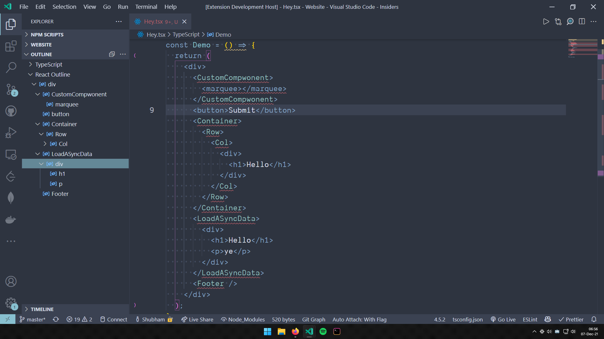

## React Outline

---

## Contributing

I am open for contributions.Feel free to raise features requests or PRS!

Head over to the [Github repo](https://github.com/ShubhamVerma1811/vscode-react-outline) and make a pull request or raise features requests or issues.

### Running Locally

Clone this repo and start the "Debug: Start Debugging" command

---

## Support

If you liked this extensions then check out my other [extensions](https://marketplace.visualstudio.com/publishers/ShubhamVerma18) and [Follow me on Twitter](https://shbm.fyi/tw).

---

## About

This extension enables support for symbols and outlines for a React files.

It can detect:

- JSXElements
- JSXFragments
- JSXMemberExpressions

Here are the screenshots of with and without the extension:

---

Made with ❤️ by [Shubham Verma](https://shbm.fyi/)
