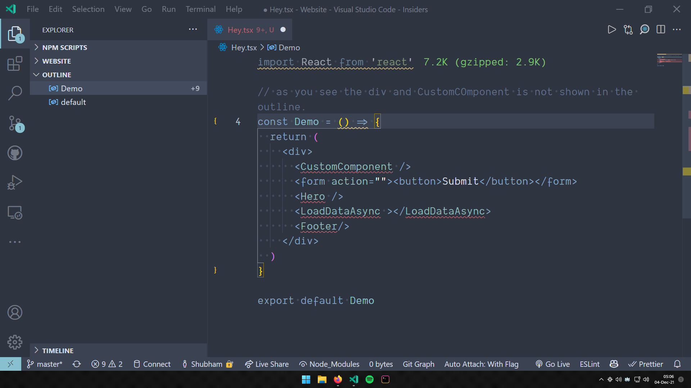

## React Outline

---

This is a simple extension that shows the symbols and outlines for a React file.

It can detect custom components and also html tags.

Here are the screenshots of with and without the extension:

### **With the Extension:**

---

### **Wihtout the Extension:**

## Contributing

I am open for contributions.Feel free to raise features requests or PRS!

Head over to the [Github repo](https://github.com/ShubhamVerma1811/vscode-react-outline) and make a pull request or raise features requests or issues.

### Running Locally

Clone this repo and start the "Debug: Start Debugging" command

---

## Support

If you liked this extensions then check out my other [extensions](https://marketplace.visualstudio.com/publishers/ShubhamVerma18) and [follow me on twitter](https://shbm.fyi/tw).

You can also Buy Me a Coffee

---

Made with ❤️ by [Shubham Verma](https://shbm.fyi/)
