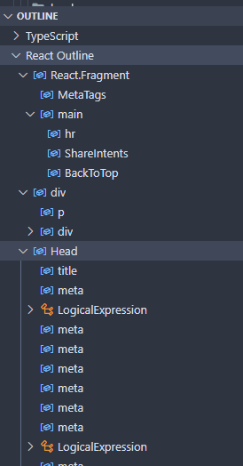

## React Outline

---

## Support

If you liked this extensions then check out my other [extensions](https://marketplace.visualstudio.com/publishers/ShubhamVerma18) and [Follow me on Twitter 💙](https://shbm.fyi/tw).

---

## About

This extension enables support for symbols and outlines for a React files.

It can detect the following types of symbols, with nested support!

- JSXElements - `<Tags></Tags>`
- JSXFragments - `<>Tags</>` or `<React.Fragment></React.Fragment>`
- JSXMemberExpressions - `<Tags.Member></Tags.Member>`
- Logical expressions - `true && <Comp/>`
- Conditional expressions - `true ? <Comp1/> : <Comp2/>`

---

## Screenshot

Here are the screenshots of with and without the extension:

---

Made with ❤️ by [Shubham Verma](https://shbm.fyi/)
